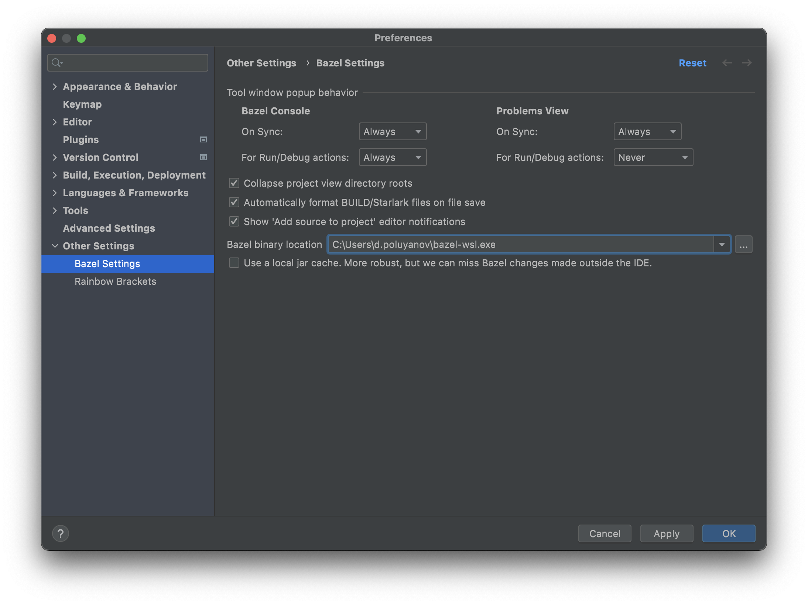

# bazel-wsl

Download latest `bazel-wsl.exe` to any location and change Bazel binary location in
(screenshots took from macos just for convenience):

Install preferred bazel version in wsl linux distro (I'd strongly recommend to
use [Bazelisk](https://github.com/bazelbuild/bazelisk))

Download your bazel project to any location inside in default WSL distro and open it
with [IntelliJ IDEA WSL integration](https://www.jetbrains.com/help/idea/how-to-use-wsl-development-environment-in-product.html)

Press "Sync project with BUILD files" button and wait for initial synchronization (It may take some time to initial
bazel cache population)